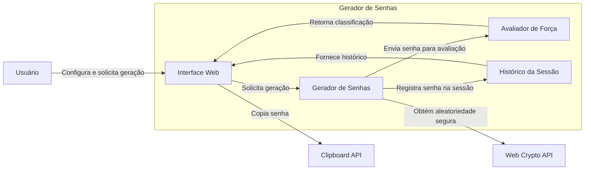
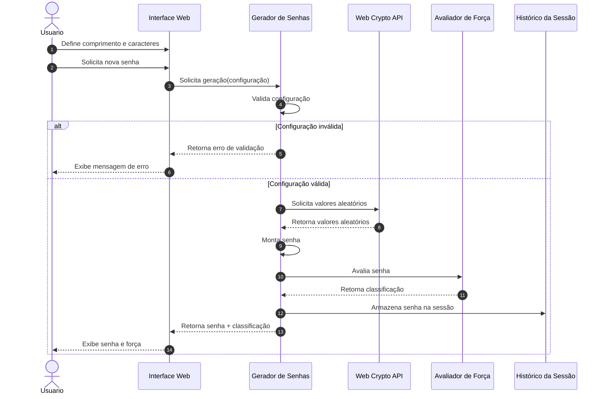

# Gerador de Senhas Seguras — Arquitetura

## 1. Visão geral
O projeto consiste em uma aplicação web para geração de senhas aleatórias e personalizadas.

O objetivo principal é permitir que um usuário gere uma senha com características definidas por ele, como comprimento e tipos de caracteres permitidos, sem que seja necessário informar ou armazenar dados pessoais.

A aplicação deverá priorizar simplicidade de uso, segurança na geração dos valores aleatórios e proteção contra armazenamento indevido das senhas produzidas.

Esta documentação descreve o sistema ainda em fase de definição arquitetural, antes da implementação. Dessa forma, as decisões apresentadas aqui representam o comportamento e os limites esperados do sistema e não dependem de uma implementação específica.

## 2. Escopo
O sistema deverá permitir:

- escolher o comprimento da senha;
- selecionar os conjuntos de caracteres permitidos;
- gerar uma senha aleatória;
- validar se as opções selecionadas permitem a geração;
- apresentar a senha gerada ao usuário;
- indicar uma classificação de força da senha;
- copiar a senha para a área de transferência;
- apresentar, opcionalmente, um histórico das senhas geradas durante a sessão;
- permitir a limpeza desse histórico;
- oferecer uma interface simples e responsiva.

A geração deverá utilizar uma fonte de aleatoriedade apropriada para uso criptográfico disponibilizada pelo navegador, evitando mecanismos inadequados para geração de senhas.

## 3. Fora do escopo
Não fazem parte do escopo inicial:

- criação de contas de usuários;
- autenticação;
- armazenamento de senhas em banco de dados;
- sincronização de senhas entre dispositivos;
- recuperação de senhas;
- gerenciamento de credenciais;
- compartilhamento de senhas com terceiros;
- geração de senhas por inteligência artificial;
- análise de vazamento de senhas em serviços externos.

Essas funcionalidades poderiam ser consideradas em versões futuras, mas não fazem parte da arquitetura inicial.

## 4. Nível da visão arquitetural
A visão apresentada é uma visão de containers inspirada no modelo C4.

O objetivo é identificar os principais elementos necessários para que o sistema funcione e as responsabilidades de cada um, sem detalhar classes, métodos ou estruturas internas de código.

O sistema é concebido inicialmente como uma aplicação web executada no navegador do usuário, sem necessidade de um backend próprio.

## 5. Limites e responsabilidades

### Usuário
É responsável por informar as preferências para a geração da senha e utilizar o resultado apresentado pela aplicação.

O usuário não deve precisar conhecer detalhes sobre o algoritmo de geração ou sobre a implementação da aleatoriedade.

### Interface Web
É responsável por:

- receber as configurações do usuário;
- apresentar os controles da aplicação;
- apresentar a senha gerada;
- apresentar mensagens de validação;
- permitir a cópia da senha;
- apresentar o histórico da sessão.

A interface não deve ser responsável diretamente pelas regras de geração da senha.

### Gerador de Senhas
É responsável por:

- validar as configurações recebidas;
- montar os conjuntos de caracteres permitidos;
- gerar os caracteres da senha;
- garantir o comprimento solicitado;
- utilizar uma fonte de aleatoriedade adequada;
- devolver a senha gerada para a camada responsável pela apresentação.

### Avaliador de Força
É responsável por classificar a senha de acordo com critérios previamente definidos.

A classificação é uma indicação de qualidade e não deve ser interpretada como garantia absoluta de segurança.

### Histórico da Sessão
É responsável por manter temporariamente as senhas geradas durante a sessão, caso essa funcionalidade esteja habilitada.

O histórico não deverá ser persistido em servidor.

## 6. Integrações
A aplicação deverá utilizar recursos disponibilizados pelo próprio navegador:

- Web Crypto API para geração de números aleatórios seguros;
- Clipboard API para permitir a cópia da senha;
- APIs de armazenamento do navegador somente quando uma decisão explícita determinar a necessidade de persistência de preferências, como tema da interface.

Não está prevista integração com serviços externos para a geração das senhas.

## 7. Restrições
A arquitetura inicial possui as seguintes restrições:

1. A aplicação deverá funcionar em navegadores modernos.
2. A geração da senha deverá ocorrer localmente no dispositivo do usuário.
3. As senhas não deverão ser enviadas para um servidor apenas para serem geradas.
4. O sistema não deverá depender de um banco de dados para sua funcionalidade principal.
5. A geração deverá utilizar uma fonte de aleatoriedade apropriada para aplicações de segurança.
6. O sistema deverá continuar funcional mesmo sem conexão com um serviço externo.
7. A interface deverá ser responsiva para diferentes tamanhos de tela.

## 8. Lacunas identificadas
Durante a definição da arquitetura foram identificadas algumas decisões que precisam ser explicitadas antes de uma implementação definitiva:

- Qual deve ser o comprimento mínimo e máximo permitido?
- Quais conjuntos de caracteres estarão disponíveis?
- A senha deverá obrigatoriamente conter pelo menos um caractere de cada conjunto selecionado?
- Como exatamente será calculada a força da senha?
- O histórico deverá existir na primeira versão?
- Quantas senhas poderão permanecer no histórico?
- O histórico deverá desaparecer ao fechar a aba?
- A preferência de tema deverá ser persistida?
- O que deverá acontecer quando a Clipboard API não estiver disponível?
- Quais navegadores serão oficialmente suportados?
- O sistema deverá garantir que caracteres de todos os conjuntos selecionados apareçam na senha ou apenas selecionar aleatoriamente dentro do conjunto combinado?
- Como caracteres ambíguos, como `O`, `0`, `I`, `l` e `1`, serão tratados?

Essas questões devem ser transformadas em decisões documentadas antes da implementação para evitar que agentes de desenvolvimento precisem inferir comportamentos.

---

# 9. Diagrama estrutural
A partir da descrição acima, foi utilizado GenAI para propor uma visão arquitetural em Mermaid.

### Observação sobre o diagrama
O modelo inicialmente sugeriu uma separação maior de componentes do que seria necessária para uma aplicação tão simples. A decisão adotada foi manter os elementos conceitualmente separados no modelo arquitetural, mesmo que uma implementação inicial possa agrupá-los em poucos arquivos JavaScript.

Essa decisão permite que a documentação represente responsabilidades distintas sem obrigar a implementação a criar uma estrutura excessivamente complexa.

---

# 10. Jornada crítica — geração de uma senha
A principal jornada do sistema é a geração de uma nova senha.

## 11. Decisões e ajustes realizados sobre a geração por GenAI
A primeira versão do modelo foi utilizada como ponto de partida e não foi considerada automaticamente como arquitetura definitiva.

Foram realizados os seguintes ajustes:

### Separação entre interface e geração
O modelo poderia representar a interface como responsável por gerar diretamente a senha. Essa abordagem foi ajustada para separar a responsabilidade de apresentação da responsabilidade de geração.

A decisão foi tomada para facilitar testes, manutenção e futuras alterações do algoritmo.

### Geração local
Foi definido que a senha será gerada no próprio navegador.

Essa decisão reduz a necessidade de infraestrutura backend e evita o envio da senha para um serviço externo.

### Uso de Web Crypto API
Foi definido que a geração de aleatoriedade deverá utilizar a Web Crypto API, em vez de uma função genérica de números pseudoaleatórios.

Essa decisão é especialmente importante porque o sistema lida com geração de credenciais.

### Histórico
O modelo poderia sugerir persistência das senhas geradas em banco de dados ou armazenamento permanente. Essa proposta foi rejeitada.

O histórico, caso exista, deverá permanecer limitado à sessão e não deverá ser enviado para um servidor.

### Avaliação de força
A classificação de força foi mantida como uma responsabilidade separada do gerador.

Entretanto, a fórmula exata de classificação ainda precisa ser definida. Essa informação foi deliberadamente registrada como uma lacuna, em vez de permitir que o agente de desenvolvimento invente uma regra.

## 12. Decisões que ainda precisam ser tomadas
Antes da implementação, as seguintes decisões devem ser transformadas em requisitos ou ADRs:

- definição do tamanho mínimo e máximo;
- definição dos conjuntos de caracteres;
- regras para garantir diversidade de caracteres;
- algoritmo de avaliação de força;
- quantidade máxima de itens no histórico;
- política de descarte do histórico;
- tratamento de falhas da Clipboard API;
- navegadores suportados;
- política para caracteres ambíguos;
- necessidade ou não de persistir preferências de interface.

O objetivo desta documentação é justamente evitar que essas decisões sejam tomadas implicitamente pelo agente de desenvolvimento.

## 13. Uso de GenAI
A GenAI foi utilizada como apoio para:

- identificar possíveis componentes do sistema;
- propor responsabilidades;
- gerar uma primeira versão dos diagramas Mermaid;
- sugerir uma sequência para a jornada de geração de senha;
- identificar possíveis integrações com APIs do navegador;
- levantar decisões arquiteturais que precisavam ser explicitadas.

A saída do modelo não foi considerada uma especificação definitiva. As propostas foram revisadas e ajustadas de acordo com os objetivos do sistema e com os princípios de segurança e simplicidade definidos para o projeto.

## 14. Objetivo da documentação para futuros agentes
Esta documentação deve funcionar como contexto arquitetural para futuros agentes de desenvolvimento.

Um agente deverá conseguir identificar:

- o objetivo do sistema;
- o que está e o que não está no escopo;
- as responsabilidades de cada parte;
- as integrações permitidas;
- as restrições de segurança;
- as decisões já tomadas;
- as decisões ainda pendentes.

Sempre que uma informação estiver marcada como lacuna, o agente não deverá inventar uma decisão. Deve solicitar esclarecimento ou propor alternativas explicitamente antes de implementar um comportamento não definido.